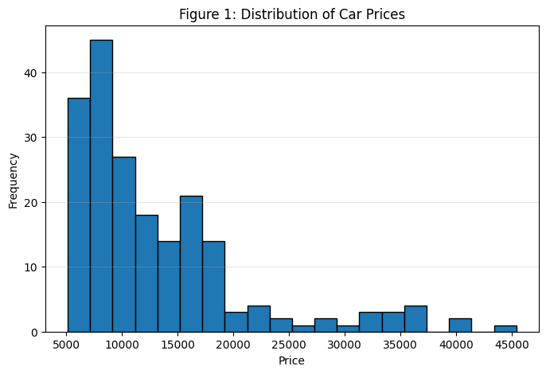
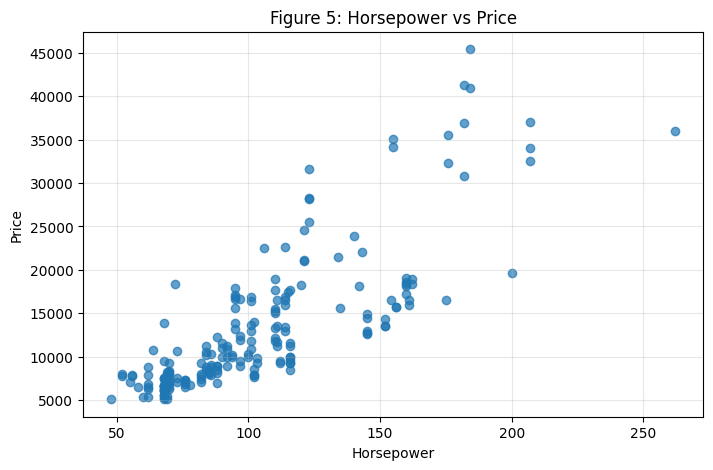
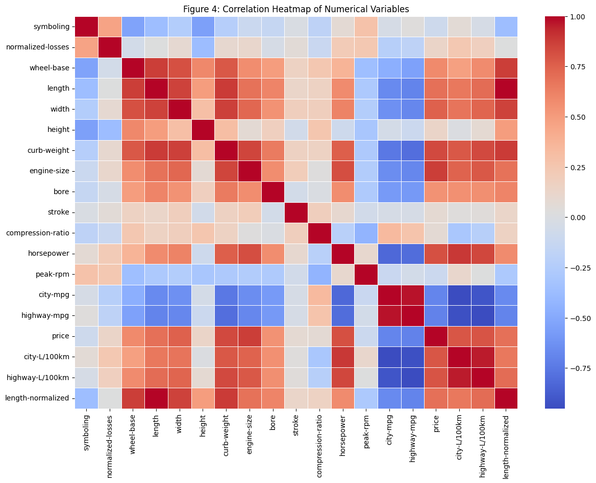
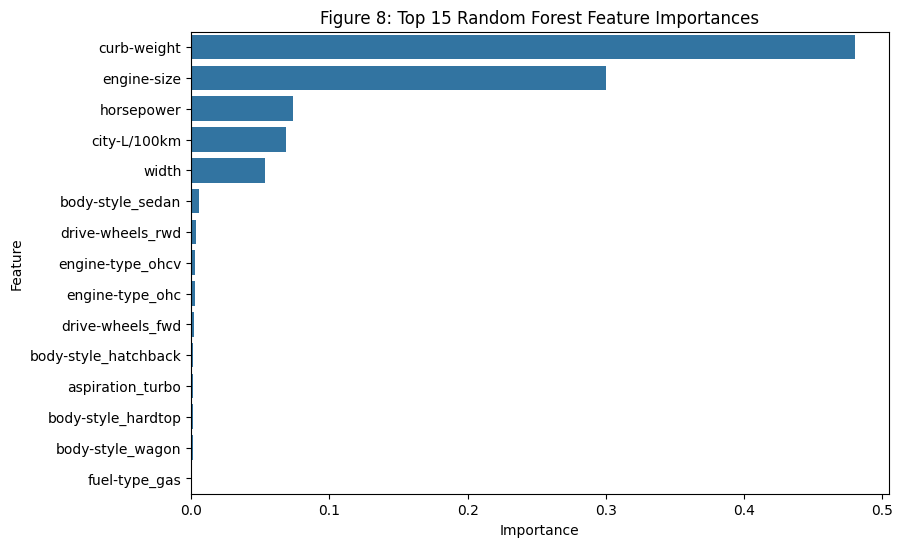
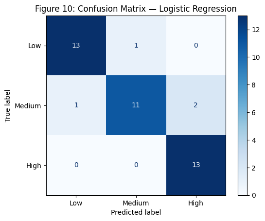

#  MSC Data Analytics:
FDA Assignment: Car Price Prediction Using Data Analytics and Machine Learning

## Project Overview

This project applies data analytics and machine learning techniques to predict automobile prices using technical and categorical vehicle characteristics.

The project covers the complete analytics workflow:

- Data Cleaning
- Missing Value Treatment
- Feature Engineering
- Exploratory Data Analysis (EDA)
- Regression Modelling
- Classification Modelling
- Business Insights and Recommendations

---

## Dataset Summary

| Metric | Value |
|----------|----------|
| Original Dataset | 205 Rows |
| Final Dataset | 201 Rows |
| Features | 26 Variables |
| Target Variable | Price |

Missing values were treated using:

- Mean imputation for numerical variables
- Mode imputation for categorical variables

Question marks were replaced with missing values and all records with no target variable were removed, leaving 201 valid 
observations for modelling

---

## Exploratory Data Analysis

### Price Distribution

The majority of vehicles were concentrated in lower and medium price ranges, while a small number of premium vehicles formed a high-value tail.

### Horsepower vs Price

A positive relationship was observed between horsepower and vehicle price. However, horsepower alone was not sufficient to explain pricing differences, suggesting that multiple factors influence vehicle value.

### Correlation Analysis

The strongest relationships with vehicle price were:

| Feature | Correlation |
|----------|----------|
| Engine Size | 0.872 |
| Curb Weight | 0.834 |
| Horsepower | 0.810 |
| Highway L/100km | 0.801 |
| City L/100km | 0.790 |

---

## Machine Learning Models

### Regression Models

Two regression models were developed:

- Linear Regression
- Random Forest Regressor

### Results

| Model | R² Score |
|---------|---------|
| Linear Regression (80/20) | 0.819 |
| Random Forest (80/20) | 0.928 |
| Linear Regression (70/30) | 0.828 |
| Random Forest (70/30) | 0.920 |

### Best Performing Model

✅ Random Forest Regressor

- R² = 0.928
- MAE = 1,912
- RMSE = 2,973

The Random Forest model significantly outperformed Linear Regression, suggesting that automobile pricing contains complex and non-linear relationships.

---

## Classification Model

Vehicle prices were grouped into:

- Low Price
- Medium Price
- High Price

A Logistic Regression model was trained to classify vehicles into these categories.

### Classification Results

- Accuracy: 90.2%

---

## My Analysis

One of the most interesting findings from this project was that vehicle price is not determined by a single characteristic.

While horsepower is often associated with expensive vehicles, the analysis demonstrated that engine size, vehicle weight, fuel consumption, and vehicle dimensions collectively play a significant role in determining market value.

The Random Forest model substantially outperformed Linear Regression, indicating that vehicle pricing contains complex interactions between multiple variables. This highlights the importance of selecting models capable of capturing non-linear relationships when solving real-world business problems.

---

## My Recommendations

Based on the analysis, I would recommend:

### For Manufacturers

- Focus on engine size, horsepower, and vehicle weight when developing premium product segments.
- Use predictive analytics to evaluate pricing strategies before launching new models.

### For Dealerships

- Use machine learning models to assess whether listed vehicle prices align with technical specifications.
- Improve inventory planning by identifying high-value vehicle characteristics.

### For Customers

- Compare market prices against model predictions to identify potentially overpriced or undervalued vehicles.
- Consider multiple vehicle attributes rather than relying on horsepower alone when evaluating value.

---

## Personal Reflection

This project strengthened my understanding of the complete data analytics lifecycle, from raw data preparation through to business-focused recommendations.

The most valuable lesson was learning that successful analytics projects are not only about building accurate models. They also require critical thinking, business interpretation, and the ability to communicate technical findings to non-technical audiences.

The project demonstrated how machine learning can be used as a practical decision-support tool for pricing, market segmentation, and business strategy.

---

## Technologies Used

- Python
- Pandas
- NumPy
- Matplotlib
- Seaborn
- Scikit-Learn
- Jupyter Notebook

---

## Author

**Fatima Ezzahra Lasfar**

## Tutor: 
**Dr Mohammad Nilchiyan**

